# Project 7 — Serverless Contact Form with Lambda, API Gateway, and SES

## Overview
Built a fully serverless contact form that sends real emails — no servers, no EC2 instances, no infrastructure to manage. When a visitor submits the form on my portfolio website the request flows through API Gateway to a Python Lambda function which calls Amazon SES to deliver the email to my inbox. The entire backend runs on-demand and costs nothing at portfolio scale.

**Live contact form:** https://d10kxon076mkn.cloudfront.net

## AWS Services Used
- **AWS Lambda** — Python 3.12 serverless function handling form submissions and calling SES
- **Amazon API Gateway** — HTTP API exposing a POST /contact endpoint that triggers Lambda
- **Amazon SES** — Simple Email Service delivering form submissions to verified inbox
- **Amazon S3** — Hosting the contact.html frontend (from Project 1)
- **AWS IAM** — Lambda execution role with least-privilege SES and CloudWatch permissions

## Architecture

User fills out contact form on S3 hosted page
↓ HTTPS POST with JSON payload
API Gateway — POST /contact endpoint
↓ Event trigger
Lambda — contact-form-handler (Python 3.12)
↓ boto3 ses_client.send_email()
Amazon SES — delivers email to verified inbox
↓
Email arrives with name, email, and message

## What I Built

### Lambda Function (Python)
- Parses JSON form data from API Gateway event body
- Extracts name, email, and message fields
- Calls SES SendEmail API using boto3
- Returns CORS-compliant JSON response with status codes
- Handles ClientError and unexpected exceptions with error responses
- Handles CORS OPTIONS preflight requests

### API Gateway (HTTP API)
- POST /contact route integrated with Lambda function
- CORS configured to allow requests from any origin
- Auto-deployed to $default stage
- HTTPS endpoint with AWS-managed SSL certificate

### Contact Form (HTML/CSS/JavaScript)
- Clean responsive single-page form
- XMLHttpRequest POST to API Gateway endpoint
- Success and error state handling with user-friendly messages
- Form reset on successful submission

### IAM Security
- Dedicated Lambda execution role: lambda-ses-contact-form-role
- Permissions: AWSLambdaBasicExecutionRole and AmazonSESFullAccess
- Least-privilege design — Lambda cannot access any other AWS services

## Key Learnings
- How serverless event-driven architecture eliminates server management overhead
- How API Gateway acts as the bridge between browser requests and Lambda functions
- How Lambda IAM execution roles follow least-privilege security principles
- How CORS headers enable cross-origin requests from S3-hosted frontends
- How SES sandbox mode restricts sending to verified addresses in development
- How boto3 Python SDK enables Lambda to call AWS services programmatically
- Why serverless is cost-effective at portfolio scale — zero cost when idle

## Production Improvements
- Request SES production access to send to any email address
- Add API Gateway usage plans and API keys to prevent abuse
- Add Lambda input validation and sanitization
- Add reCAPTCHA to prevent spam submissions
- Store form submissions in DynamoDB for backup
- Move to remote state with S3 backend for Terraform management

## Cost
$0.00 — Lambda (1M free requests/month), API Gateway (1M calls free/month for 12 months), and SES (62,000 emails/month free from Lambda) all within free tier at portfolio scale.

## Screenshots

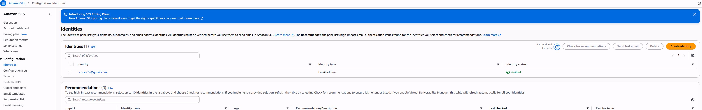
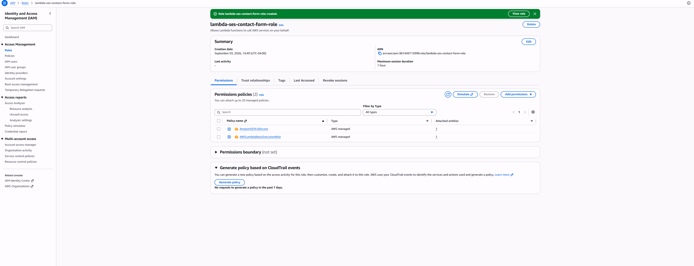
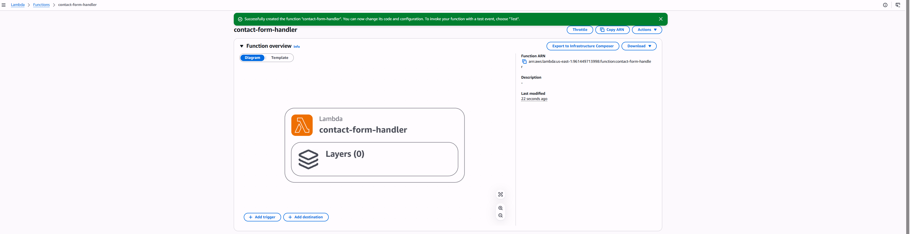
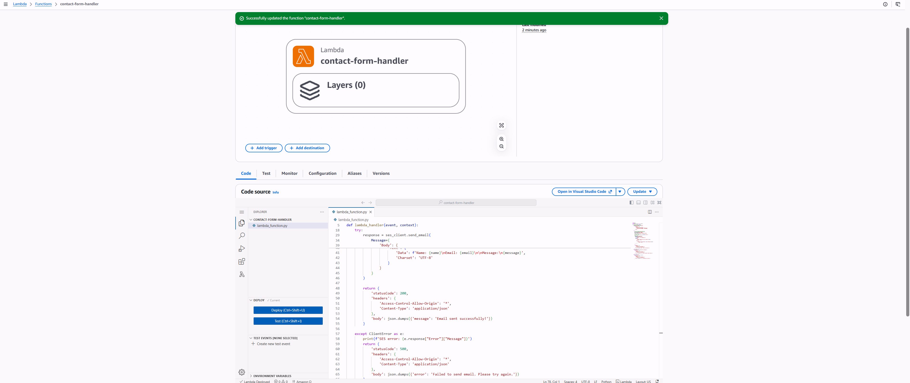
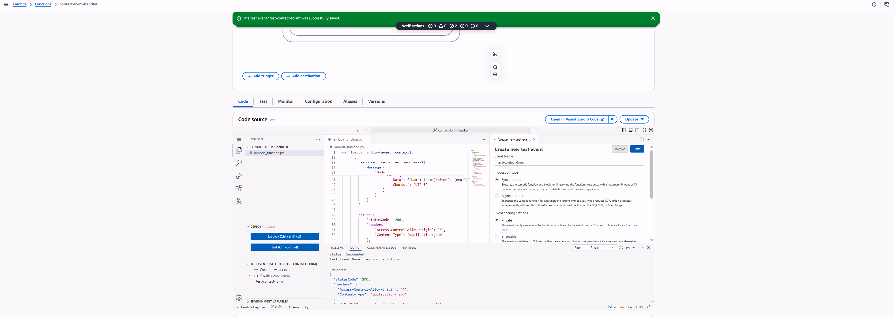
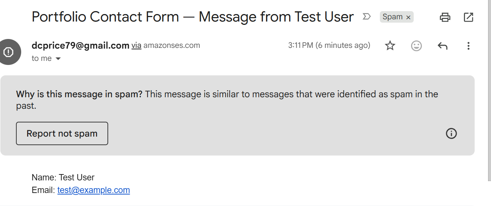
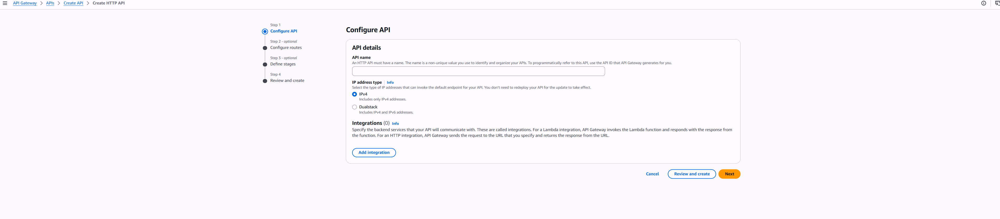
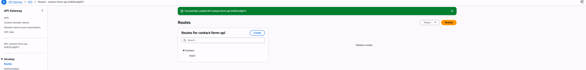
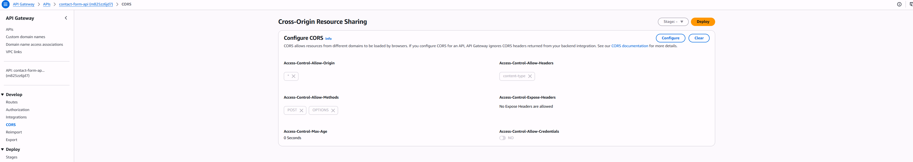

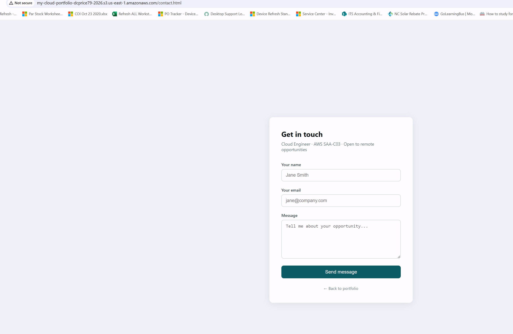
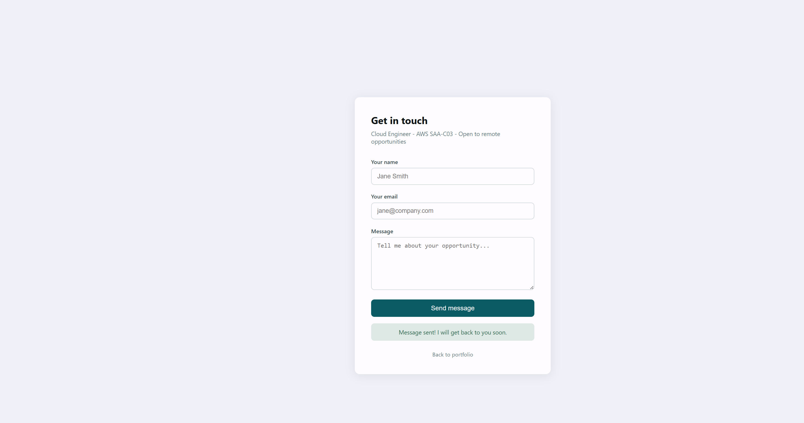
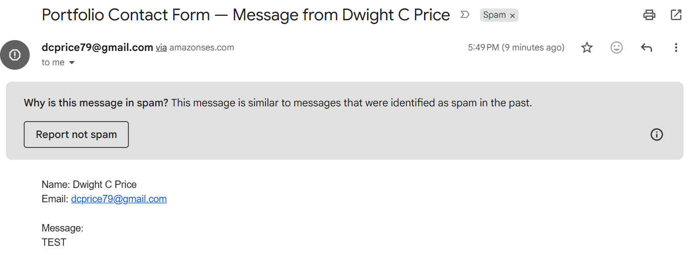
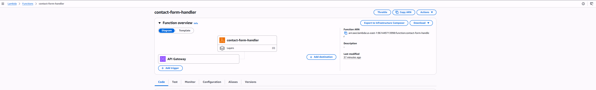
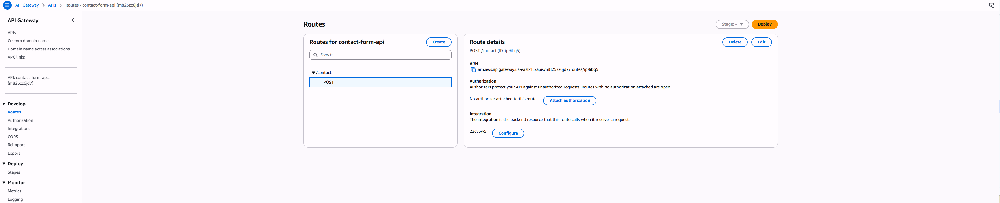
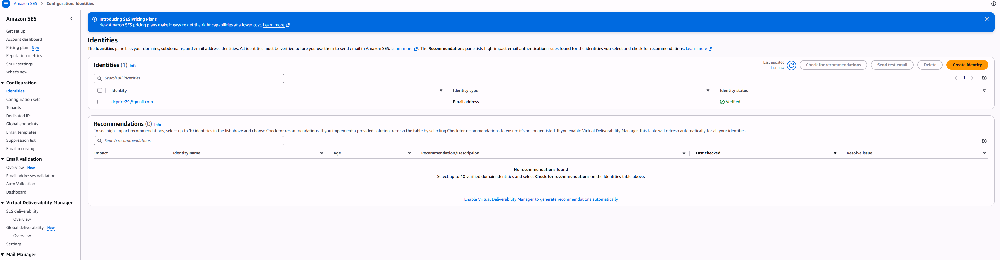

---
*Part of my AWS Cloud Engineering Portfolio | [View all projects](https://github.com/dcprice79)*
